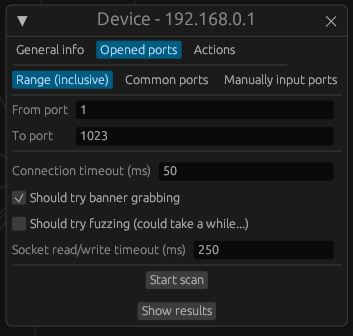

# Naive network scanner

### Meta information

I started this project to build a penetration testing tool, even though I lacked experience in the field.
As I developed it (and expanded my pen-testing skills), I realized that what I was building, wasn't going to help while penetration testing, at all.
So, I decided to reshape this into solely a naive network scanning tool and keep it as is :D

### What works?

- Hostname retrieval
- IP Range scan
  - Range scan (from IP to IP)
  - CIDR notation scan
  - Manually inputting IPs scan
  - All options include:
    - Ping timeout setting
    - Ping checkup setting
    - localhost exclusion
    - Ability to visually see connection reset
- Port scan
  - Range scan (from port to port)
  - Common ports scan (around 400 most common ports, ready to be scanned)
  - Manually inputting ports scan
  - All options include:
    - Ability to allow banner grabbing
    - Ability to allow fuzzing
    - Connection timeout setting
    - Socket read/write timeout setting
- Ability to add a new computer to the network topology graph
- Ability to add your computer to the network topology graph
- Ability to remove computers from the network topology graph
- Ability to open multiple computer subwindows at once (even of the same window)
- Visualization of which devices can and cannot be reached
- Nice looking visualization

# How to use (after you compiled it, see Dev section)

After you launch the program (in development mode), you're gonna see something like this:

Only the following tabs include some kind of functionality:

- View menu button
  - Ability to show and hide different workspace tabs
- General
  - Add this computer
  - Add a new device
  - Refresh connection status to all devices (soft)
  - Refresh connection status to all devices (hard)
- Discovery
  - Retrieve hostnames (all devices)
- Discovery (inside network)
  - Scan IP Range
- Network topology
  - The big graph lol :D
  - Ability to edit each node
  - Ability to scan each node's ports
- Status Info
  - Logging inside the UI about what the program's doing

By default, in development mode, there are always these 4 nodes + your PC node when you start the program.

### View the menu button

Use the View menu button to toggle the visibility of different workspace tabs.

"Highlighted tabs" are visible, the rest are hidden.

### Add this computer

This will add YOUR computer to the network topology:

However, if you already have your computer in the topology, you will receive the following warning message:

### Add a new device

Add devices to the network topology with validation and ping confirmation option

### Refresh connection status to all devices

Understand connection statuses through visual cues:

and refresh them with one of the following modes:

(soft) => Visually removes connections that do not respond to ping

(hard) => Initially removes all connections and then establishes the connections once again

### Retrieve hostnames (all devices)

Retrieve and display hostnames associated with IP addresses.

### Scan IP Scanning options

- Ping timeout => How long to wait for a response
- Ping checkup => How frequently check whether the ping responded
- Exclude localhost => Excludes your ip from the range
- Remove connectivity status when unreachable => During the scan, if the program encounters a node that responded in the past, but doesn't respond now, remove the connectivity status of that node
- Reset connectivity status => Every node's connectivity status gets reset, it doesn't matter whether the node was in the range or not.

### Ability to edit each node

Click on one of the nodes, inside the topology graph, and the following window will pop up:

Here, you can edit whatever you want and the changes will get immediately saved.

### Scan open ports

Click on the "Opened ports" submenu and select one of the port scanning options

- Connection timeout => How long to wait for a response
- Should try banner grabbing => Technique used to determine more information about the software running on the port
- Should try fuzzing => Try sending a couple of common commands that some programs respond to
- Socket read/write timeout => How long to wait for a response, after successfully initializing a socket connection

### Scan results

Click on the "Show results" button and you will see the port scanning results:

When you hover over the "found" text, you will see the output command output.

### Remove the device from the topology

Click on the "Actions" submenu and then click on the "Delete" button.

### Status info (example)

Here's an example of logs inside "Status Info"

Btw, because egui had (at the time) an internal memory leak when you updated one label over and over while locking a mutex, I had to limit the "Status Info" refresh rate to once every 5 seconds. So, if you don't see any output right after clicking, just wait for a bit before panicking :D

### Example network scan result

# Dev

- On Windows, make sure you're running cargo commands from the admin console.
- On Linux, run `cargo b && sudo target/debug/teef-ui`
- If you have any problems compiling, it's probably due to `pnet` package, and it's very likelly you'll find the fix [on their github repo page.](https://github.com/libpnet/libpnet)
